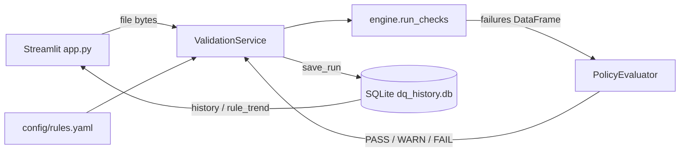
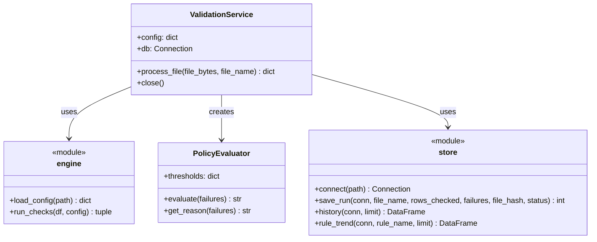
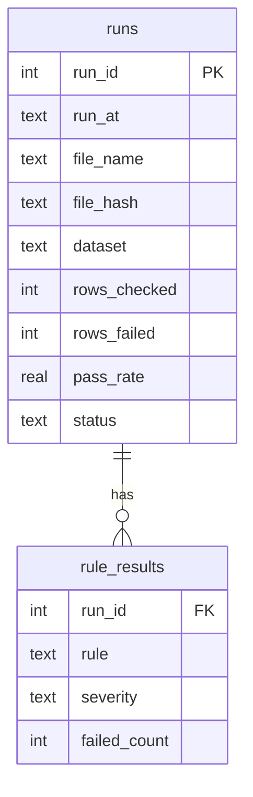
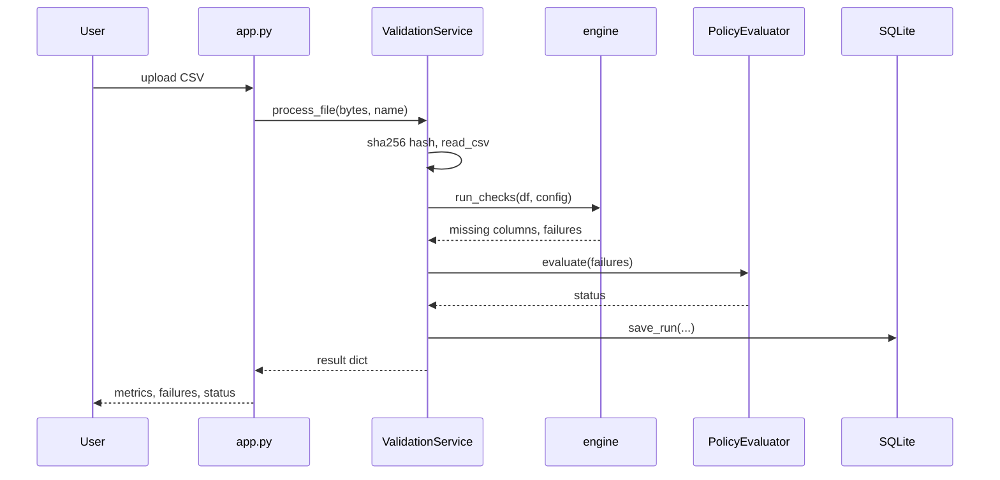

# Diagrams

## Architecture (config -> engine -> policy -> store)

```mermaid
flowchart LR
    UI[Streamlit app.py] -->|file bytes| SVC[ValidationService]
    CFG[config/rules.yaml] --> SVC
    SVC --> ENG[engine.run_checks]
    ENG -->|failures DataFrame| POL[PolicyEvaluator]
    POL -->|PASS / WARN / FAIL| SVC
    SVC -->|save_run| STORE[(SQLite dq_history.db)]
    STORE -->|history / rule_trend| UI
```

## Class diagram

```mermaid
classDiagram
    class ValidationService {
        +config: dict
        +db: Connection
        +process_file(file_bytes, file_name) dict
        +close()
    }
    class PolicyEvaluator {
        +thresholds: dict
        +evaluate(failures) str
        +get_reason(failures) str
    }
    class engine {
        <<module>>
        +load_config(path) dict
        +run_checks(df, config) tuple
    }
    class store {
        <<module>>
        +connect(path) Connection
        +save_run(conn, file_name, rows_checked, failures, file_hash, status) int
        +history(conn, limit) DataFrame
        +rule_trend(conn, rule_name, limit) DataFrame
    }
    ValidationService --> engine : uses
    ValidationService --> PolicyEvaluator : creates
    ValidationService --> store : uses
```

## Database schema

```mermaid
erDiagram
    runs ||--o{ rule_results : has
    runs {
        int run_id PK
        text run_at
        text file_name
        text file_hash
        text dataset
        int rows_checked
        int rows_failed
        real pass_rate
        text status
    }
    rule_results {
        int run_id FK
        text rule
        text severity
        int failed_count
    }
```

## Validation sequence

```mermaid
sequenceDiagram
    participant U as User
    participant A as app.py
    participant S as ValidationService
    participant E as engine
    participant P as PolicyEvaluator
    participant D as SQLite
    U->>A: upload CSV
    A->>S: process_file(bytes, name)
    S->>S: sha256 hash, read_csv
    S->>E: run_checks(df, config)
    E-->>S: missing columns, failures
    S->>P: evaluate(failures)
    P-->>S: status
    S->>D: save_run(...)
    S-->>A: result dict
    A-->>U: metrics, failures, status
```
